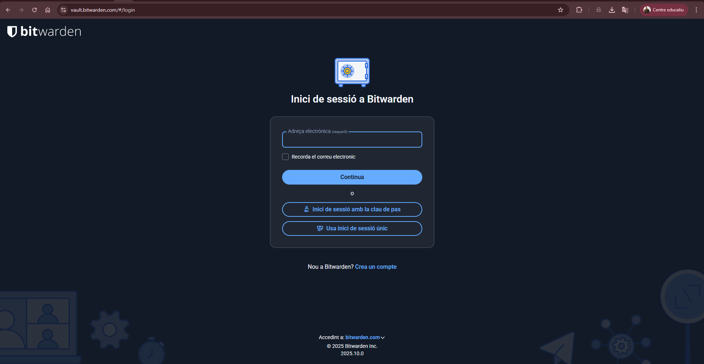
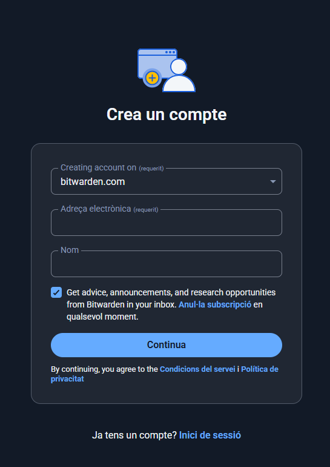
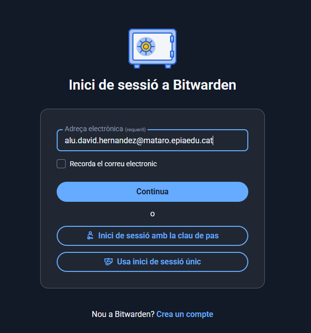
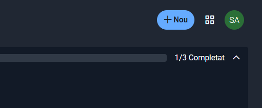
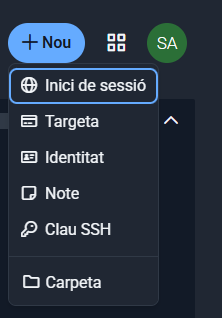
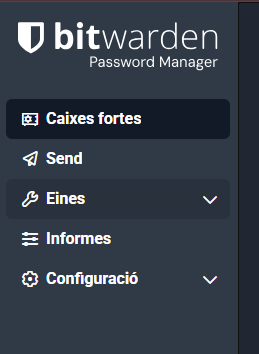
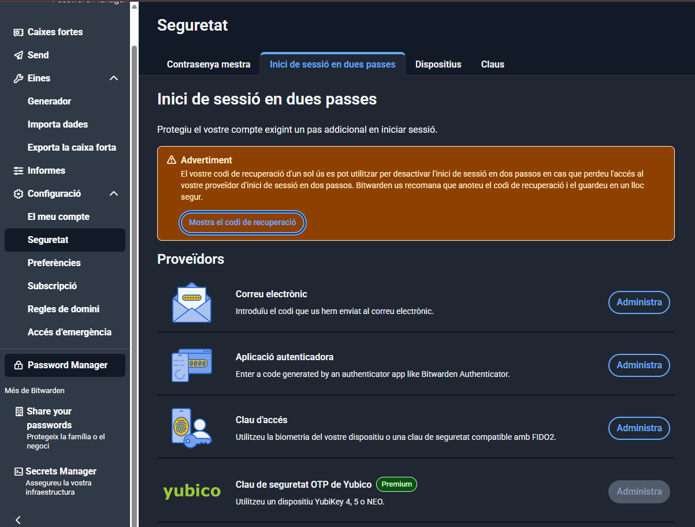

# Guía de Uso de Bitwarden Web (Chrome)

Esta guía está pensada para usuarios que desean gestionar sus contraseñas de forma segura utilizando **Bitwarden** desde su versión web en el navegador **Google Chrome**. A continuación, se detallan los pasos para crear una cuenta, acceder al servicio y comenzar a utilizarlo.

---

## Índice

1. [Acceso a Bitwarden Web](#1-acceso-a-bitwarden-web)  
2. [Creación de una cuenta nueva](#2-creación-de-una-cuenta-nueva)  
3. [Inicio de sesión](#3-inicio-de-sesión)  
4. [Primeros pasos en la interfaz](#4-primeros-pasos-en-la-interfaz)  
5. [Instalación de la extensión del navegador (opcional)](#5-instalación-de-la-extensión-del-navegador-opcional)  
6. [Agregar un nuevo elemento](#6-agregar-un-nuevo-elemento)  
7. [Otras funciones del menú lateral](#7-otras-funciones-del-menú-lateral)  
8. [Consejos de seguridad](#8-consejos-de-seguridad)

---

## 1. Acceso a Bitwarden Web

1. Abre Google Chrome.  
2. Dirígete a la página oficial: [https://vault.bitwarden.com](https://vault.bitwarden.com)

---

## 2. Creación de una Cuenta Nueva

1. Haz clic en **"Crea un compte"** (Create Account).  
2. Completa el formulario:
   - **Nombre de usuario**
   - **Correo electrónico**
   - **Contraseña maestra** (elige una contraseña segura y fácil de recordar)
   - **Confirmación de contraseña**
   - **Pista de contraseña** (opcional)
3. Acepta los términos y condiciones.  
4. Haz clic en **"Crea un compte"** para finalizar.

---

## 3. Inicio de Sesión

1. Vuelve a [https://vault.bitwarden.com](https://vault.bitwarden.com).  
2. Introduce tu correo electrónico y contraseña maestra.  
3. Haz clic en **"Inicia sessió"**.

---

## 4. Primeros Pasos en la Interfaz

Al iniciar sesión, verás la pantalla principal con el título **"Totes les caixes fortes"**. Aparecerá una barra de progreso con los siguientes pasos:

1. **Crear un compte** ✅ Completado

3. **Importa dades**: Puedes importar contraseñas desde otros gestores o archivos CSV.  
4. **Instal·la l'extensió del navegador**: Recomendado para una mejor experiencia.

Haz clic en el botón azul **"Element nou"** para comenzar a agregar tus datos.

---

## 5. Instalación de la Extensión del Navegador (opcional)

1. Abre una nueva pestaña en Chrome.  
2. Visita la Chrome Web Store: [Extensión de Bitwarden](https://chrome.google.com/webstore/detail/bitwarden-free-password-m/nngceckbapebfimnlniiiahkandclblb)  
3. Haz clic en **"Añadir a Chrome"** y luego en **"Añadir extensión"**.  
4. Inicia sesión en la extensión con tu cuenta de Bitwarden.

---

## 6. Agregar un Nuevo Elemento

1. En la pantalla principal, haz clic en **"Element nou"**.  
2. Selecciona el tipo de elemento:

   - **Login** (inicio de sesión)
   - **Tarjeta** (datos de tarjeta de crédito)
   - **Identidad** (datos personales)
   - **Nota segura**
4. Rellena los campos necesarios:
   - Nombre
   - Usuario
   - Contraseña
   - URL (si aplica)
5. Haz clic en **"Desa"** para guardar.

---

## 7. Otras Funciones del Menú Lateral

- **Enviar**: Comparte información de forma segura con otros usuarios.  
- **Dines**: Opciones relacionadas con pagos (según el plan).  
- **Informes**: Revisión de seguridad de contraseñas y actividad.  
- **Configuració**: Cambios de idioma, seguridad, autenticación en dos pasos, etc.

---

## 8. Consejos de Seguridad

- Activa la **autenticación en dos pasos (2FA)**.  
- Usa contraseñas únicas y complejas para cada sitio.  
- Aprovecha el **generador de contraseñas** integrado.  
- No compartas tu contraseña maestra con nadie.

---

> Esta guía está pensada para estudiantes de Sistemas Microinformáticos y Redes, y puede adaptarse a entornos educativos o profesionales.
