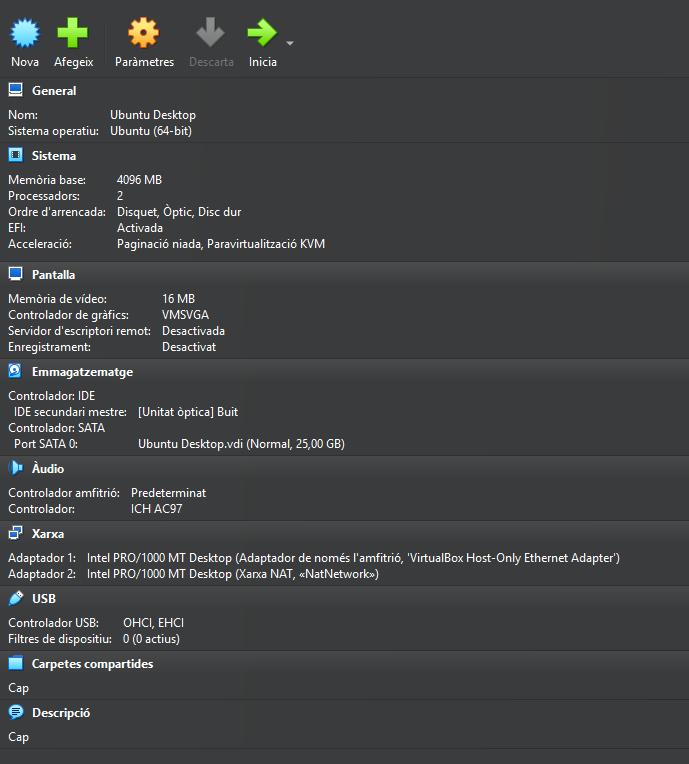

# 1. Objeto del Encargo

El objeto del presente Pliego es la instalación, configuración y validación de un servicio **OpenLDAP** en un entorno virtual basado en **Ubuntu Server**.  
Este servicio debe configurarse para actuar como un directorio centralizado de usuarios y grupos para el dominio de pruebas **innovatechXX.test**.

El objetivo principal es crear un servicio robusto que permita gestionar de forma centralizada las cuentas de usuario y sus permisos, mejorando así la eficiencia operativa y la seguridad de la empresa Innovatech.

---

## 🧩 Requisitos y configuración de la infraestructura inicial

Para llevar a cabo esta implementación, es imprescindible definir y preparar correctamente el entorno virtual donde se instalarán tanto el **servidor LDAP** como el **cliente Ubuntu Desktop** que se conectará al directorio.

Las configuraciones y recursos que se detallan a continuación son las que se han utilizado en este caso práctico, basadas en los requisitos mínimos recomendados para asegurar un funcionamiento estable y una comunicación correcta entre máquinas.

---

### ⚙️ Requisitos mínimos recomendados

| Rol               | Sistema Operativo               | RAM         | CPU        | Disco      | Tipo de Red       | Finalidad                                       |
|-------------------|-------------------------------|-------------|------------|------------|-------------------|------------------------------------------------|
| **Servidor LDAP**  | Ubuntu Server 24.04.3 (64-bit) | 2 GB mínimo | 1 núcleo   | 20 GB      | NAT + Host-Only   | Servicio OpenLDAP y gestión de usuarios         |
| **Cliente LDAP**   | Ubuntu Desktop 24.04.3 (64-bit)| 2 GB mínimo | 1 núcleo   | 20 GB      | NAT + Host-Only   | Autenticación centralizada desde el directorio |

---

### 🖥️ Configuración utilizada en este caso práctico

#### Servidor LDAP – *T04_UbuntuServerCarlosF*  
- Ubuntu Server 24.04.3 LTS (64-bit)  
- 4096 MB RAM  
- 2 núcleos CPU  
- 25 GB disco (VDI, SATA)  
- Red: Adaptador 1 (NAT), Adaptador 2 (Host-Only)  
- Gráficos: VMSVGA - 16 MB  
- Audio: ICH AC97  
- Aceleración: Paravirtualización KVM

#### Cliente LDAP – *Ubuntu Desktop*  
- Ubuntu Desktop 24.04.3 LTS (64-bit)  
- 4096 MB RAM  
- 2 núcleos CPU  
- 25 GB disco (VDI, SATA)  
- Red: Adaptador 1 (Host-Only), Adaptador 2 (NAT)  
- Gráficos: VMSVGA - 16 MB  
- Audio: ICH AC97  
- Aceleración: Paravirtualización KVM  

