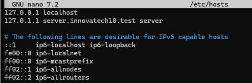
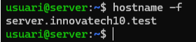
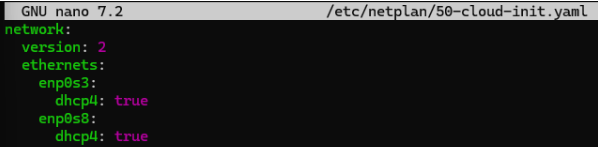
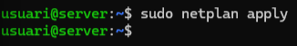
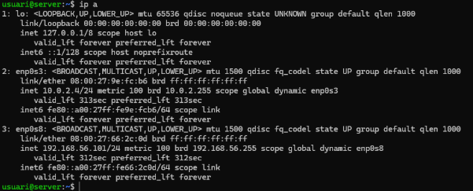

# 2. Requisitos de Infraestructura Inicial

El consultor ha de verificar la correcta configuració de la infraestructura virtual abans d'iniciar la implementació:

| **ID**      | **Descripció del Requeriment**                               | **Configuració Requerida**                                      |
|-------------|---------------------------------------------------------------|-----------------------------------------------------------------|
| R.INF.01    | Configuració de la màquina Server (Server Hostname).          | `server.innovatechXX.test`                                      |
| R.INF.02    | Interfície de Xarxa Pública.                                  | NAT (Per accés a Internet i descàrrega de paquets).              |
| R.INF.03    | Interfície de Xarxa Privada.                                  | Host-Only (Per a comunicació privada amb el Client virtual i la màquina física). |

## Paso 1: Configuración del nombre del servidor (Hostname)

### Introducción
En este paso configuraremos el **nombre del servidor** y su dominio para que el servicio OpenLDAP pueda identificar correctamente el host dentro del dominio de pruebas `innovatech10.test`.  
Esto es fundamental para que los clientes puedan autenticarse y para la correcta gestión del directorio centralizado.

### Pasos detallados

1. Abrir el archivo de hosts con privilegios de superusuario:

```
sudo nano /etc/hosts
```

Este comando abre el archivo /etc/hosts, donde se configuran las asociaciones entre direcciones IP y nombres de host.

2. Modificar la línea correspondiente al hostname y añadir el dominio:
```
127.0.1.1 server.innovatech10.test server
```


Guarda y cierra el archivo (Ctrl+O, Enter, Ctrl+X en nano). Esto define el nombre del servidor y el dominio asociado.

3. Verificar la configuración del hostname:

```
hostname
```


Muestra el nombre del host actual (server en este caso).

```
hostname -f
```


Muestra el nombre de host completo con el dominio (server.innovatech10.test).

### Notas importantes

- Asegúrate de que el hostname completo coincide con el dominio que vas a usar en OpenLDAP (innovatech10.test).

- Cambiar el archivo /etc/hosts requiere privilegios de superusuario, por lo que se utiliza sudo.

- El comando hostname -f debe devolver el nombre completo; si no es así, revisa que la línea añadida en /etc/hosts esté correcta.

## Paso 2 y 3: Configuración de Interfaces de Red (Pública y Privada)

### Introducción
En este paso configuraremos las **interfaces de red** del servidor utilizando **Netplan**. Definiremos dos adaptadores:

- **Interfaz pública** (para acceso externo)
- **Interfaz privada** (para comunicación interna)

Esto es esencial para que el servidor pueda interactuar tanto con la red corporativa como con la red interna del servicio LDAP.

---

### Pasos detallados

1. Editar el archivo de configuración de Netplan. Abrimos el archivo con privilegios de superusuario:
```
sudo nano /etc/netplan/50-cloud-init.yaml
```
Dentro del archivo, definimos las interfaces con DHCP habilitado:



Guarda y cierra el archivo `(Ctrl+O, Enter, Ctrl+X)`

2. Aplicar la configuración
Ejecuta el siguiente comando para aplicar los cambios:
```
sudo netplan apply
```



3. Verificar las interfaces configuradas
Para comprobar que las interfaces están activas y con IP asignada:
```
ip a
```



Debes ver ambas interfaces (enp0s3 y enp0s8) con sus direcciones IP correspondientes, similar a la salida mostrada en la captura:

### Notas importantes

- Asegúrate de que los nombres de las interfaces (enp0s3, enp0s8) coincidan con los que detecta tu sistema.
- Si necesitas IPs estáticas en lugar de DHCP, deberás modificar la configuración en el mismo archivo Netplan.
- Después de aplicar los cambios, si no ves las IPs, revisa la conexión física o la configuración del adaptador en la máquina virtual.
