21 # 3. Tareas de Implementación y Configuración del Servidor LDAP

La Consultora **EverPia** debe cumplir estrictamente con las siguientes tareas de instalación y configuración:

## 3.1. Instalación y Configuración Base de OpenLDAP

| **ID**       | **Descripción de la Tarea**                         | **Detalles de la Configuración**                                                                |
|--------------|------------------------------------------------------|------------------------------------------------------------------------------------------------|
| T.LDAP.01    | Instalación del servicio OpenLDAP.                   | Se debe mostrar el resultado del comando `slapcat` para validar la instalación base.            |
| T.LDAP.02    | Configuración de la base de datos.                   | Nombre del Dominio: `innovatechXX.test`                                                         |
| T.LDAP.03    | Configuración de la contraseña de administrador.     | Contraseña: `p@ssw0rd`                                                                          |
| T.LDAP.04    | Creación de Unidades Organizativas (OU) iniciales.   | Se deben crear dos OUs: `users` y `groups` mediante un archivo `.ldif`.                         |
| T.LDAP.05    | Validación de las Unidades Organizativas.            | Realizar una consulta con `ldapsearch` que muestre todas las OUs creadas en el directorio.       |

---

## Paso 1: Instalación del servicio OpenLDAP

### Introducción
En este paso instalaremos el **servicio OpenLDAP** en el servidor. Este servicio será la base para la autenticación centralizada y la gestión del directorio dentro del dominio `innovatech10.test`.

---

### Pasos detallados

1. Actualizar los repositorios
Antes de instalar, actualizamos los paquetes del sistema:
```
sudo apt update && sudo apt upgrade -y
```
2. Instalar OpenLDAP y utilidades
Instalamos el servidor LDAP y las herramientas necesarias:
```
sudo apt install slapd ldap-utils -y
```
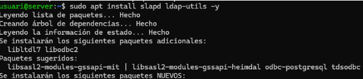

Durante la instalación, se solicitará:

Contraseña del administrador LDAP (guárdala para los siguientes pasos).
Confirmar la configuración básica del servicio.

3. Reconfigurar el servicio (opcional)
Si necesitas ajustar el dominio o la contraseña del administrador:
```
sudo dpkg-reconfigure slapd
```
Aquí podrás definir:

Dominio base: `innovatech10.test`
Organización: `innovatech10`
Contraseña del administrador LDAP: `p@ssw0rd`

4. Verificar la instalación y estructura del directorio
Para comprobar que el directorio se ha creado correctamente:
```
sudo slapcat
```
Salida esperada:


### Notas importantes

- El comando slapcat muestra el contenido del directorio LDAP en formato LDIF.
- Verifica que el dn (Distinguished Name) coincide con el dominio configurado (dc=innovatech10,dc=test).
- Si la estructura no aparece como esperabas, revisa la configuración con dpkg-reconfigure slapd.
---
## Paso 2 y 3: Configuración de la base de datos y contraseña del administrador

### Introducción
En este paso configuraremos la **base de datos LDAP** y definiremos la **contraseña del administrador** durante la instalación del servicio OpenLDAP. Este proceso asegura que el directorio esté correctamente inicializado con el dominio y la organización deseada.

---

### Pasos detallados

1. Iniciar la configuración interactiva
Si no se realizó durante la instalación, ejecuta:
```
sudo dpkg-reconfigure slapd
```
2. Introducir el nombre de dominio DNS
En la pantalla de configuración (fondo lila), se solicitará el nombre de dominio DNS. Introduce:

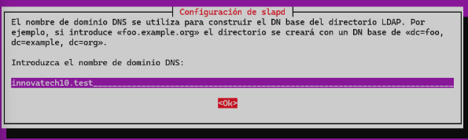

```
innovatech10.test
```

3. Definir el nombre de la organización
En el siguiente paso, introduce:

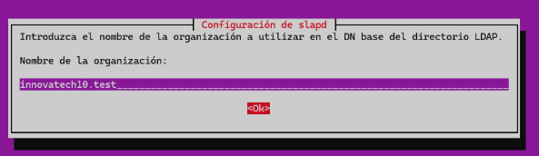

```
innovatech10.test
```

Pulsa OK para continuar.

4. Establecer la contraseña del administrador LDAP
Cuando se solicite la contraseña del administrador, introduce:

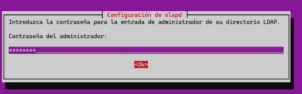

```
p@ssw0rd
```

5. Confirmar opciones adicionales
¿Desea que se borre la base de datos cuando se purgue el paquete slapd?
Selecciona: " YES "


¿Desea mover la base de datos antigua?
Selecciona: " YES "

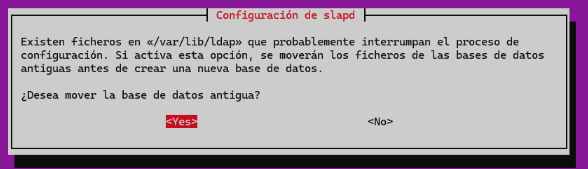

6. Verificar la configuración
Para comprobar que la base de datos se ha creado correctamente otra vez:
```
sudo slapcat
```
salida esperada:

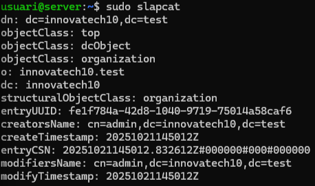

### Notas importantes

- El comando slapcat muestra el contenido del directorio LDAP en formato LDIF.
- Verifica que el dn coincide con el dominio configurado (dc=innovatech10,dc=test).
- Si la estructura no aparece como esperabas, repite la configuración con dpkg-reconfigure slapd.

---

## Paso 4 y 5: Creación y Validación de Unidades Organizativas (OU)

### Introducción
En este paso crearemos las **Unidades Organizativas (OU)** iniciales en el directorio LDAP y validaremos su correcta creación. Las OUs permiten organizar los objetos del directorio en categorías como usuarios y grupos.

Se crearán dos OUs:
- **users**
- **groups**

---

### Pasos detallados

1. Crear la OU `users`
Abrimos/creamos un archivo LDIF para definir la OU:
```
sudo nano ou_users.ldif
```
Contenido del archivo:

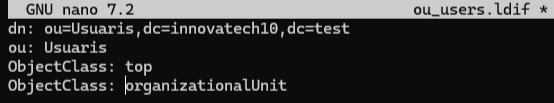

Guarda y cierra el archivo ` (Ctrl+O, Enter, Ctrl+X) `.

2. Añadir la OU users al directorio LDAP
Ejecuta el siguiente comando:
```
ldapadd -D "cn=admin,dc=innovatech10,dc=test" -W -f ou_users.ldif
```
3. Crear la OU groups
Abrimos otro archivo LDIF:
```
sudo nano ou_groups.ldif
```
Contenido del archivo:

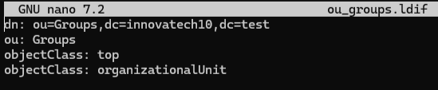

Guarda y cierra el archivo ` (Ctrl+O, Enter, Ctrl+X) `.

4. Añadir la OU groups al directorio LDAP
Ejecuta:
```
ldapadd -D "cn=admin,dc=innovatech10,dc=test" -W -f ou_groups.ldif
```
5. Validar las OUs creadas
Para comprobar que las OUs se han creado correctamente:
```
ldapsearch -xLLL -b "dc=innovatech10,dc=test" ou
```
Salida esperada (similar a la captura):

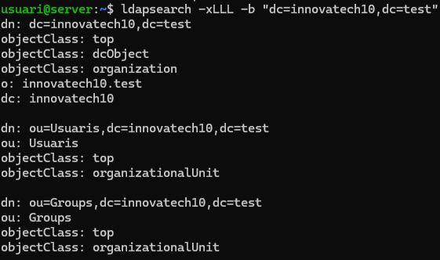

### Notas importantes

- El comando ldapadd requiere la contraseña del administrador LDAP (p@ssw0rd).
- Si aparece un error, revisa que el contenido del archivo LDIF esté correcto y que el dominio coincida con el configurado.
- El comando ldapsearch permite validar la existencia de las OUs en el directorio.

---

## 3.2. Gestión y Administración (LAM)

| **ID**       | **Descripción de la Tarea**                         | **Detalles de la Configuración**                                                                |
|--------------|------------------------------------------------------|------------------------------------------------------------------------------------------------|
| T.LAM.01     | Instalación del Gestor de Usuarios LDAP (LAM).       | Se debe documentar el comando de instalación.                                                   |
| T.LAM.02     | Acceso Remoto y Configuración.                       | Conectar a LAM desde la máquina física utilizando la dirección IP de la interfaz Host-Only.     |
| T.LAM.03     | Configuración por defecto.                           | Establecer la configuración predeterminada para que los nuevos usuarios se ubiquen en la OU `users` y los nuevos grupos en la OU `groups`. |
| T.LAM.04     | Creación de Grupos.                                  | Crear dos grupos de seguridad en el directorio: `tech` y `manager`.                             |
| T.LAM.05     | Creación de Usuarios de Prueba.                      | Crear un usuario para cada grupo: `tech01` (miembro de `tech`) y `manager01` (miembro de `manager`). |

---

## T.LAM.01: Instalación del Gestor de Usuarios LDAP (LAM)

### Introducción
En este paso instalaremos **LDAP Account Manager (LAM)**, una herramienta web que permite gestionar usuarios, grupos y otros objetos del directorio LDAP de forma sencilla. Este gestor facilitará la administración del servicio OpenLDAP.

---

### Pasos detallados

1. Instalar LAM
Ejecuta el siguiente comando para instalar el gestor:
```
sudo apt install ldap-account-manager -y
```
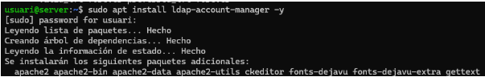

Durante la instalación:

Se solicitará la contraseña del administrador.
El sistema iniciará la instalación y configuración automática del servicio.


2. Verificar la instalación
Una vez completada la instalación, puedes comprobar que el servicio está activo:
```
systemctl status apache2
```
LAM se ejecuta sobre Apache, por lo que este servicio debe estar en estado active (running).

3. Acceder a LAM
Abre un navegador y accede a:
```
http://<IP-del-servidor>/lam
```
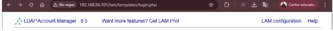

Desde esta interfaz podrás:

- Configurar la conexión con el servidor LDAP.
- Administrar usuarios, grupos y otras entradas del directorio.

### Notas importantes

- Asegúrate de que el servidor tiene conectividad y que el puerto HTTP (80) está abierto.
- Si deseas usar HTTPS, deberás configurar certificados SSL en Apache.
- La contraseña del administrador LDAP será necesaria para conectar LAM con el directorio.

## Paso 2: Acceso Remoto y Configuración

### Introducción
En este paso accederemos al **LDAP Account Manager (LAM)** desde la máquina física utilizando el navegador web. Para ello, debemos asegurarnos de que la máquina virtual (servidor) tenga activo y correctamente configurado el **adaptador anfitrión/host-only**, lo que permitirá la conexión entre el equipo físico y la máquina virtual.

---

### Pasos detallados

1. Verificar la configuración de red
Asegúrate de que la máquina virtual tiene:
- **Adaptador anfitrión (Host-Only)** habilitado.
- Una dirección IP asignada en la red host-only (por ejemplo, `192.168.56.x`).

Puedes comprobarlo con:
```
ip a
```
2. Acceder al LAM desde el navegador
En la máquina física:

Abre tu navegador web.
Introduce la siguiente URL:
```
http://<IP-del-servidor>/lam
```
Ejemplo:
http://192.168.56.101/lam


3. Pantalla de inicio de sesión
Si todo está configurado correctamente, se mostrará la pantalla de inicio de sesión de LAM, donde podrás introducir las credenciales del administrador LDAP.

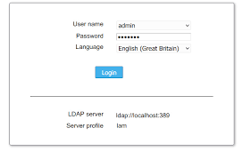

### Notas importantes

Si la página no carga, revisa:

- Que el servicio Apache esté activo (systemctl status apache2).
- Que la IP usada sea la correcta.
- Que no haya bloqueos en el firewall.

- El acceso remoto solo funcionará si el adaptador host-only está configurado y la máquina física está en la misma red.

---

## Paso 3: Configuración por defecto en LAM

### Introducción
En este paso estableceremos la **configuración predeterminada** en **LDAP Account Manager (LAM)** para que:
- Los **nuevos usuarios** se ubiquen en la OU `users`.
- Los **nuevos grupos** se ubiquen en la OU `groups`.

Esto garantiza que la estructura del directorio LDAP se mantenga organizada.

---

### Pasos detallados

1. Acceder a la configuración de LAM
- Desde la pantalla de inicio de sesión de LAM, haz clic en **LAM configuration** (parte superior izquierda).
- Selecciona **Edit server profiles**.
- Introduce la contraseña (por defecto suele ser `lam`) y pulsa **OK**.

---

2. Configurar el perfil del servidor
En la pantalla de configuración:
- Puedes ajustar idioma, zona horaria y otros parámetros.
- Nosotros iremos a la pestaña **Tipos de cuentas**.

---

3. Definir los sufijos LDAP para usuarios y grupos
Desplázate hasta la sección **Usuarios** y **Grupos** y configura:
en este caso:

**Usuarios:**
Sufijo LDAP: ou=users,dc=innovatech10,dc=test
**Grupos:**
Sufijo LDAP: ou=groups,dc=innovatech10,dc=test

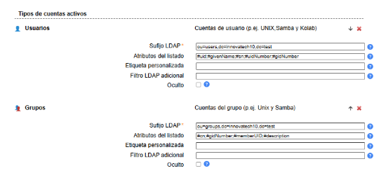

---

4. Guardar cambios
- Haz clic en **Guardar** y confirma los cambios.
- Esto aplicará la configuración predeterminada para la creación de cuentas.

---

### Notas importantes
- Asegúrate de que las OUs `users` y `groups` ya existen en el directorio LDAP (creadas en pasos anteriores).
- Si la contraseña por defecto (`lam`) no funciona, revisa la documentación o restablece la configuración.
- Esta configuración es esencial para que LAM cree usuarios y grupos en las unidades organizativas correctas.

---

## Paso 4: Creación de Grupos

### Introducción
En este paso crearemos dos **grupos de seguridad** en el directorio LDAP utilizando **LDAP Account Manager (LAM)**. Los grupos permiten organizar usuarios y asignar permisos de manera más eficiente.

Grupos a crear:
- `tech`
- `manager`

---

### Pasos detallados

1. Iniciar sesión en LAM
- Accede a la interfaz web de LAM:
- Introduce las credenciales del administrador LDAP.

---

2. Ir a la sección de grupos
- En la parte superior, haz clic en **Cuentas**.
- Selecciona la opción **Grupos**.

---

3. Crear los grupos
- Haz clic en **Añadir nuevo grupo**.
- Introduce el nombre del grupo:
  - `tech`
  - `manager`

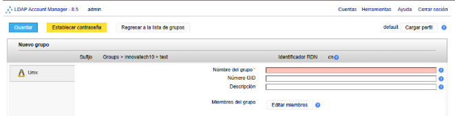

- Configura los atributos necesarios (por defecto suele ser suficiente).
- Haz clic en **Guardar** para cada grupo.

---

4. Verificar la creación
Después de guardar, ambos grupos deben aparecer en la lista de grupos del LAM.

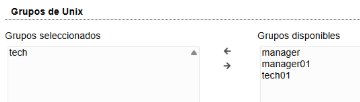

---

### Notas importantes
- Asegúrate de que los sufijos LDAP para grupos están configurados correctamente (ver paso anterior).
- Si el grupo no se crea, revisa la conexión con el servidor LDAP y la configuración del perfil en LAM.
- Estos grupos se usarán para asignar usuarios en pasos posteriores.

---

## Paso 5: Creación de Usuarios de Prueba

### Introducción
En este paso crearemos dos **usuarios de prueba** en el directorio LDAP utilizando **LDAP Account Manager (LAM)**. Cada usuario será asignado a uno de los grupos creados previamente:

- `tech01` → miembro del grupo **tech**
- `manager01` → miembro del grupo **manager**

---

### Pasos detallados

1. Iniciar sesión en LAM
- Accede a la interfaz web:
- Introduce las credenciales del administrador LDAP.

---

2. Ir a la sección de usuarios
- En la parte superior, haz clic en **Cuentas**.
- Selecciona la opción **Usuarios**.

---

3. Crear el usuario `tech01`
- Haz clic en **Añadir nuevo usuario**.
- Introduce el nombre: `tech01`.
- Marca la opción **Crear grupo propio** (si aparece).
- Configura el directorio inicial:
`/home/tech01`
- Configura el intérprete de inicio de sesión:
`/bin/bash`
- Haz clic en **Editar grupos** y selecciona el grupo **tech**.
- Establece una contraseña segura para el usuario.
- Guarda los cambios.

---

4. Crear el usuario `manager01`
Repite el mismo proceso:
- Nombre: `manager01`.
- Directorio inicial:
`/home/manager01`
- Intérprete:
`/bin/bash`
- Asigna el grupo **manager**.
- Establece la contraseña.
- Guarda los cambios.

---
Ejemplo de interfaz de creacio/configuracion de usuarios

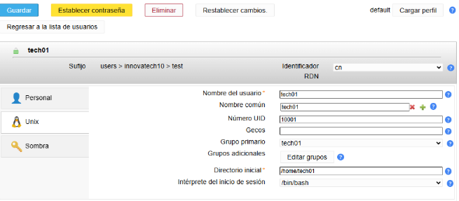

---

5. Verificar la creación
Ambos usuarios deben aparecer en la lista de usuarios del LAM, cada uno asociado a su grupo correspondiente.

---

### Notas importantes
- Asegúrate de que los sufijos LDAP para usuarios están configurados correctamente (ver paso 3).
- Si no aparece la opción de intérprete o directorio, revisa la configuración del perfil en LAM.
- Estos usuarios se usarán para pruebas de autenticación en pasos posteriores en el cliente.

---
