# 4. Integració de Client (Client Ubuntu Desktop)

| **ID**       | **Descripció de la Tasca**                     | **Detalls de la Configuració**                                                                 |
|--------------|-------------------------------------------------|------------------------------------------------------------------------------------------------|
| T.CLI.01     | Instal·lació del Client.                        | Instal·lar un client **Ubuntu Desktop** i configurar la interfície de xarxa per comunicar-se amb el servidor (**Host-Only**). |
| T.CLI.02     | Resolució de Noms.                              | Configurar l'arxiu `hosts` del client per resoldre l'adreça IP del servidor a `server.innovatechXX.test`. S'ha de proporcionar una instantània (snapshot) de la màquina client un cop fet el canvi. |
| T.CLI.03     | Validació de la Connectivitat LDAP.             | Comprovar la connectivitat amb el servidor fent una consulta `dig` des del client.       |
| T.CLI.04     | Mòduls d'Autenticació.                          | Instal·lar els mòduls necessaris per permetre l'autenticació amb **LDAP**.                      |
| T.CLI.05     | Configuració del Client.                        | Modificar els arxius de configuració del client necessaris. S'han de mostrar clarament els canvis realitzats en el codi dels arxius. |
| T.CLI.06     | Comprovació del Sistema.                        | Reiniciar els serveis i verificar amb la comanda `getent passwd` que els usuaris del directori són visibles localment. |
| T.CLI.07     | Prova d'Accés Final.                            | Reiniciar el client i iniciar sessió amb l'usuari `tech01`. Es requereix una captura de pantalla que demostri l'accés correcte i la creació automàtica de la carpeta personal de l'usuari. |

---

## Paso 1: Instalación del Cliente

### Introducción
En este paso instalaremos un **cliente Ubuntu Desktop** que servirá para realizar pruebas de autenticación contra el servidor LDAP. Además, configuraremos la interfaz de red para permitir la comunicación directa con el servidor mediante el adaptador **Host-Only**.

---

### Pasos detallados

1. Crear la máquina virtual del cliente
- Abre tu gestor de máquinas virtuales (VirtualBox, VMware, etc.).
- Crea una nueva máquina virtual con:
  - **Sistema operativo**: Ubuntu Desktop.
  - **Recursos recomendados**: 4 GB RAM, 2 CPU, 20 GB de disco.

---

2. Configurar la interfaz de red
- En la configuración de la máquina virtual, ve a **Red**.
- Cambia el adaptador principal a:

Modo: Adaptador Anfitrión (Host-Only)

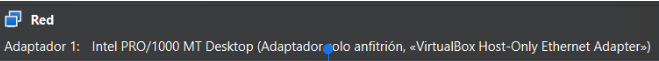 

Esto permitirá que la máquina cliente se comunique directamente con el servidor LDAP en la red interna.

---

3. Iniciar la instalación de Ubuntu Desktop
- Monta la ISO de Ubuntu Desktop.
- Sigue el asistente de instalación hasta completar la configuración básica:
  - Idioma y zona horaria.
  - **Crear un usuario llamado `Uusuario`** (este será el usuario del sistema para la configuración posterior).

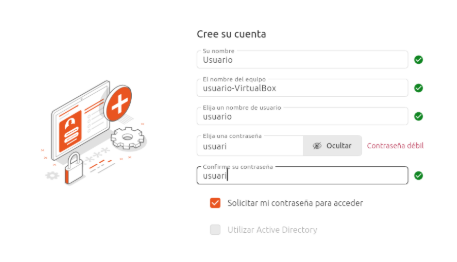 

---

4. Verificar conectividad con el servidor
Una vez instalado:
- Abre la terminal en el cliente y ejecuta:
```
ping <IP-del-servidor>
```

Ejemplo: `ping 192.168.56.101`

Si responde, la conexión Host-Only está funcionando correctamente.

### Notas importantes

- El adaptador Host-Only es fundamental para la práctica, ya que permite la comunicación directa sin depender de la red externa.
- Si el ping falla, revisa la configuración de red en la máquina virtual y en el servidor.
- El usuario cliente será usado para pruebas de autenticación en pasos posteriores.

---

## Paso 2: Resolución de Nombres

### Introducción
En este paso configuraremos el archivo **`/etc/hosts`** en el cliente para que pueda resolver el nombre del servidor LDAP mediante su dirección IP. Esto permitirá que el cliente identifique el servidor como `server.innovatech10.test`.

---

### Pasos detallados

1. Abrir la terminal en el cliente
Ejecuta el siguiente comando para editar el archivo `hosts`:
```
sudo nano /etc/hosts
```

2. Configurar las entradas en el archivo
Añade las siguientes líneas (ajusta la IP según la configuración de tu servidor):
127.0.0.1   localhost
127.0.1.1   cliente.innovatech10.test cliente
192.168.56.101   server.innovatech10.test server

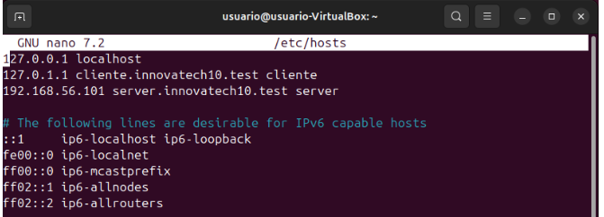 

3. Guardar y cerrar el archivo

Presiona `Ctrl+O` para guardar.
Pulsa `Enter` para confirmar.
Presiona `Ctrl+X` para salir del editor.


### Notas importantes

- La IP 192.168.56.101 corresponde al servidor LDAP en la red Host-Only.
- Si el nombre no se resuelve, verifica que la IP sea correcta y que el adaptador Host-Only esté activo.
- Puedes probar la resolución con:
```
ping server.innovatech10.test
```

---

## Paso 3: Validación de la Conectividad LDAP

### Introducción
En este paso validaremos la **conectividad entre el cliente y el servidor LDAP**. Aunque normalmente se utiliza `ldapsearch`, también podemos comprobar la resolución de nombres y conectividad mediante el comando `dig`. Antes de esto, verificaremos que el hostname del cliente esté correctamente configurado.

---

### Pasos detallados

1. Comprobar el hostname del cliente
Ejecuta:
```
hostname
```
```
hostname -f
```
hostname muestra el nombre del equipo.
hostname -f muestra el nombre completo (FQDN).

Si no aparece el nombre esperado, configúralo con:
```
sudo hostnamectl set-hostname cliente
```
o subsituye cliente por el nombre que quieras pero que tiene que coincidir con el archivo hosts

2. Validar la resolución del servidor LDAP
Ejecuta el comando dig para comprobar que el cliente resuelve correctamente el nombre del servidor:
```
dig server.innovatech10.test
```
Salida esperada

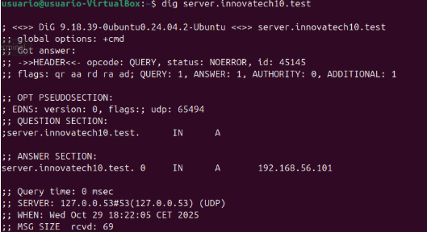 

Esto indica que el nombre server.innovatech10.test se resuelve a la IP del servidor LDAP.

3. (Opcional) Comprobar conectividad con ping
```
ping server.innovatech10.test
```
Si responde, la conexión Host-Only está funcionando correctamente.

### Notas importantes

- Si dig no devuelve la IP correcta, revisa el archivo /etc/hosts en el cliente (ver paso anterior).
- El comando hostnamectl permite establecer el nombre completo del cliente para integrarlo en el dominio.
- Esta validación es fundamental antes de configurar la autenticación LDAP en el cliente.

---

## Paso 4: Módulos de Autenticación

### Introducción
En este paso instalaremos los **módulos necesarios para permitir la autenticación con LDAP** en el cliente Ubuntu Desktop. Además, configuraremos la conexión con el servidor LDAP durante el proceso interactivo.

---

### Pasos detallados

1. Activar conexión a Internet
Para descargar los paquetes, es necesario que la máquina cliente tenga acceso a Internet:
- Añade un segundo adaptador de red en la configuración de la máquina virtual:
Modo: NAT
- Si es necesario, habilita DHCP para obtener una IP automáticamente.

---

#### 2. Instalar los paquetes necesarios
Ejecuta el siguiente comando en la terminal del cliente:
```
sudo apt install libnss-ldap libpam-ldap ldap-utils nscd -y
```
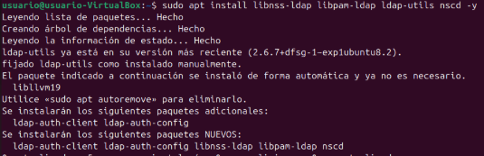 

Durante la instalación aparecerán varias pantallas de configuración (fondo lila):

3. Configuración interactiva

- Servidor LDAP:

 

Introduce:
```
ldap://server.innovatech10.test
```
Pulsa Aceptar.

- Base de búsqueda LDAP:

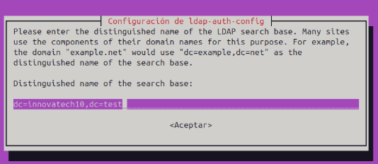 

Introduce:
```
dc=innovatech10,dc=test
```

Pulsa Aceptar.

- Versión del LDAP:

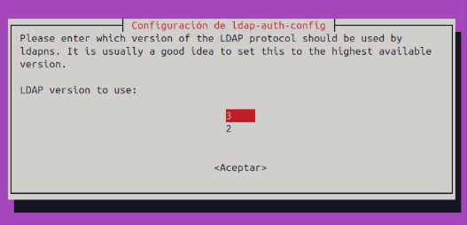 

Selecciona:
`3`
Pulsa Aceptar.


- ¿Crear base de datos local para root?

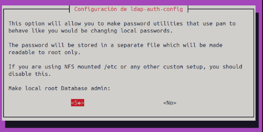 

Selecciona:
`Sí`

- ¿La base de datos LDAP requiere login?

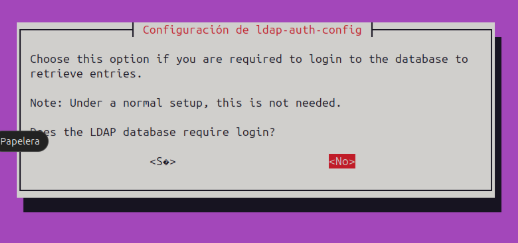 

Selecciona:
`No`

- Cuenta LDAP para root:

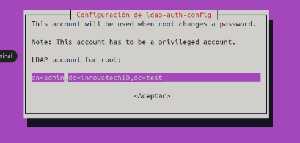 

Introduce:
```
cn=admin,dc=innovatech10,dc=test
```

Pulsa Aceptar.

- Contraseña de la cuenta LDAP root:

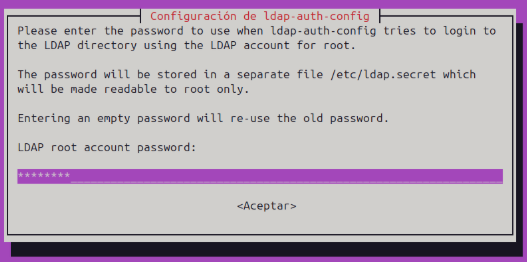 

Introduce:
```
p@ssw0rd
```

Pulsa Aceptar.

4. Verificar instalación
Puedes comprobar que los paquetes se instalaron correctamente con:
```
dpkg -l | grep ldap
```

### Notas importantes

- Si el servidor LDAP no se resuelve, revisa la configuración del archivo /etc/hosts (ver paso anterior).
- La contraseña p@ssw0rd debe coincidir con la configurada en el servidor LDAP.
- El servicio nscd ayuda a cachear las consultas para mejorar el rendimiento.

## Paso 5: Configuración del Cliente

### Introducción
En este paso modificaremos los archivos de configuración del cliente para habilitar la autenticación contra el servidor LDAP. Además, realizaremos ajustes en PAM y NSS, y finalmente aplicaremos los cambios en el sistema.

---

### Pasos detallados

1. Editar el archivo `nsswitch.conf`
Abrimos el archivo:
```
sudo nano /etc/nsswitch.conf
```
Modificamos la línea de passwd, group y shadow para incluir LDAP:
passwd:         files systemd ldap
group:          files systemd ldap
shadow:         files ldap

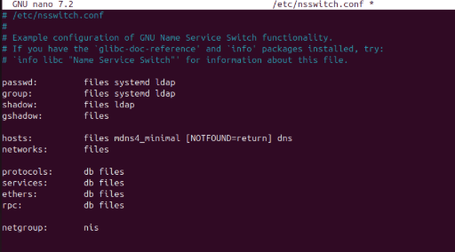 

Guarda y cierra el archivo (Ctrl+O, Enter, Ctrl+X).

2. Editar el archivo common-password
Abrimos:
```
sudo nano /etc/pam.d/common-password
```

Elimina la cuarta línea en blanco que comienza con password.

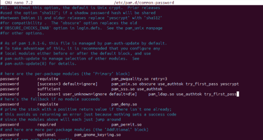 

Guarda y cierra el archivo.

3. Editar el archivo common-session
Abrimos:
```
sudo nano /etc/pam.d/common-session
```
Añadimos la siguiente línea al final:
```
session optional    pam_mkhomedir.so skel=/etc/skel umask=077
```
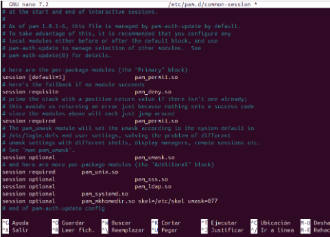 

Guarda y cierra el archivo.

4. Recargar y reiniciar servicios
Ejecuta:
```
sudo systemctl daemon-reload
```
```
sudo systemctl restart nscd
```
5. (Importante) Reconfigurar LDAP en el cliente
Si la autenticación no funciona correctamente, ejecuta:
```
sudo dpkg-reconfigure ldap-auth-config
```
Este comando abrirá un asistente para:

Definir el servidor LDAP (por ejemplo: ldap://server.innovatech10.test).
Establecer el Base DN: dc=innovatech10,dc=test.
Configurar si se desea usar LDAP para autenticación.
Activar la creación automática de directorios home.
Confirmar la conexión con el servidor.

### Notas importantes

- La línea pam_mkhomedir.so permite crear automáticamente el directorio home del usuario LDAP al iniciar sesión.
- Si el asistente de ldap-auth-config falla, revisa la conectividad con el servidor y la resolución de nombres.
- Después de estos cambios, el cliente estará listo para autenticar usuarios LDAP.

## Paso 6: Comprobación del Sistema

### Introducción
En este paso verificaremos que los usuarios del directorio LDAP son visibles localmente en el cliente. Para ello utilizaremos el comando `getent passwd`, que muestra las entradas de usuarios del sistema y del LDAP.

---

### Pasos detallados

#### 1. Ejecutar el comando de verificación
En la terminal del cliente, ejecuta:
```
getent passwd | tail
```
Este comando muestra las últimas líneas de la base de datos de usuarios. Si la integración LDAP está funcionando correctamente, deberían aparecer los usuarios creados en el servidor LDAP, por ejemplo:

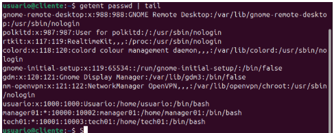 

### Notas importantes

- Si los usuarios no aparecen:

-Verifica la configuración en /etc/nsswitch.conf.
-Comprueba que el servicio nscd esté activo:
```
systemctl status nscd
```
-Asegúrate de que la conectividad con el servidor LDAP funciona (ver pasos anteriores).


- Este paso confirma que el cliente puede leer los usuarios del directorio LDAP.

---

## Paso 7: Prueba de Acceso Final

### Introducción
Este es el paso final para confirmar la integración del cliente con el servidor LDAP. Realizaremos la autenticación gráfica con un usuario LDAP (`tech01` o `manager01`) y verificaremos la creación automática del directorio personal. Antes de reiniciar, debemos ajustar la configuración PAM para permitir la autenticación en el gestor de inicio de sesión.

---

### Pasos detallados

1. Editar el archivo PAM para GDM
Abrimos el archivo:
```
sudo nano /etc/pam.d/gdm-launch-environment
```
Añadimos la siguiente línea al inicio:
```
auth    sufficient    pam-ldap.so
```
 

Guarda y cierra el archivo (Ctrl+O, Enter, Ctrl+X).
2. Reiniciar el cliente
Ejecuta:
```
sudo reboot
```

3. Iniciar sesión con un usuario LDAP
En la pantalla de inicio de sesión:

Haz clic en Iniciar sesión con otra cuenta.
Introduce el usuario:

`tech01`

o
`manager01`


Introduce la contraseña configurada en LAM.

Si todo está correcto:

Aparecerá un mensaje indicando la creación del directorio:

`Creando directorio /home/tech01`

 

El sistema iniciará sesión en la cuenta LDAP.


4. Verificar la sesión y el directorio
Una vez dentro, abre la terminal y ejecuta:
```
id
```
Salida esperada:
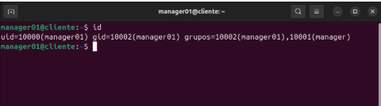 

Esto confirma que el usuario LDAP está autenticado y pertenece a los grupos correctos.

### Notas importantes

- La línea pam-ldap.so en gdm-launch-environment es esencial para la autenticación gráfica.
- Si el inicio de sesión falla:

-Verifica la conectividad con el servidor LDAP.
-Comprueba la configuración de PAM y NSS.


- Este paso confirma la integración completa del cliente con el servidor LDAP y la creación automática del directorio home.

Resultado final:
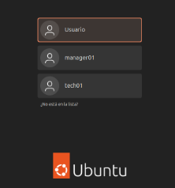 

---

