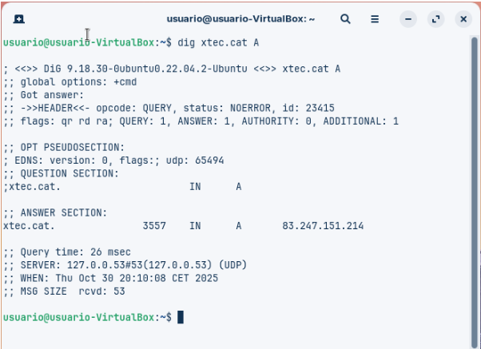
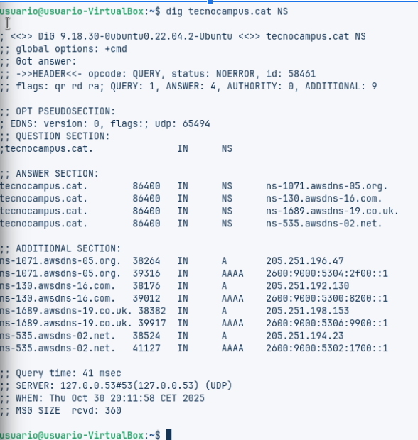
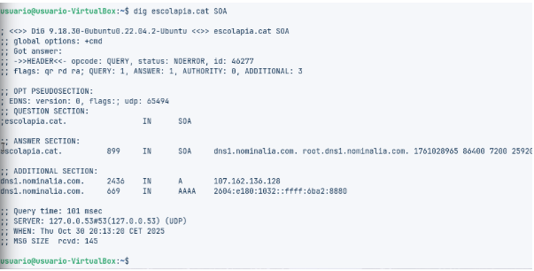
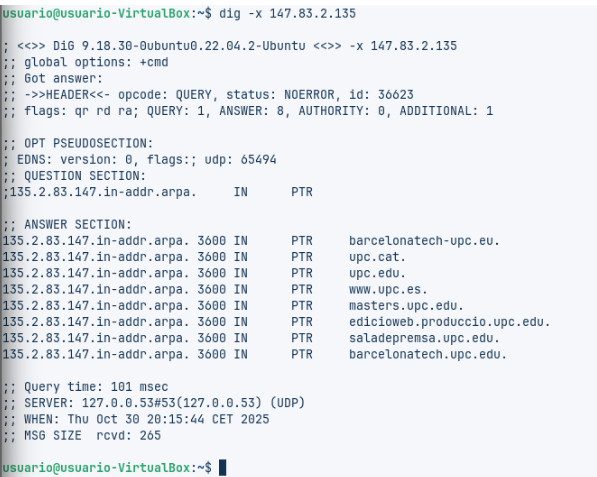
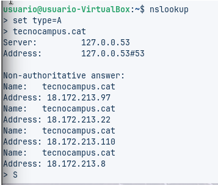
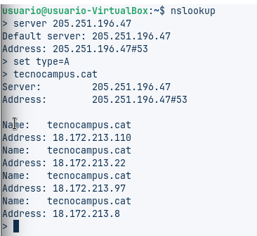

# Práctica técnica de resolución DNS

## A. Diagnóstico avanzado con dig (Linux / macOS)

### Comando 1: Consulta básica de registro A
**Comando:**  
```
dig xtec.cat A
```


### Pregunta: ¿Cuál es la IP de respuesta, el valor TTL y el servidor que ha respondido a la consulta?

**Respuesta:**

- **IP de respuesta:** `83.247.151.214`
- **TTL (Time To Live):** `3557 segundos`
- **Servidor que respondió:** `127.0.0.53#53`  
  Este servidor es el resolver DNS local del sistema, que actúa como intermediario entre el equipo y los servidores DNS externos.

---

### Comando 2: Consulta de servidores de nombres (NS)

**Comando:**
```
dig tecnocampus.cat NS
```


### Pregunta: ¿Cuáles son los servidores de nombres autoritativos para este dominio?

**Respuesta:**  
Los servidores NS autoritativos para `tecnocampus.cat` son:

- `ns-1071.awsdns-05.org`
- `ns-130.awsdns-16.com`
- `ns-1689.awsdns-19.co.uk`
- `ns-535.awsdns-02.net`

---

### Comando 3: Consulta detallada SOA

**Comando:**
```
dig escolapia.cat SOA
```


### Pregunta: ¿Cuál es la información del correo del administrador y el número de serie del dominio?

**Respuesta:**

- **Servidor primario:** `dns1.nominalia.com`
- **Correo del administrador:** `root@dns1.nominalia.com`  
  (En los registros SOA, el primer punto se reemplaza por una @ para formar el correo electrónico)
- **Número de serie:** `1761028965`

---

### Comando 4: Consulta de resolución inversa

**Comando:**
```
dig -x 147.83.2.135
```


### Pregunta: ¿Qué información sobre los registros se obtiene?

**Respuesta:**  
Se obtienen varios registros PTR que vinculan la IP `147.83.2.135` con dominios relacionados con la Universitat Politècnica de Catalunya (UPC):

- `barcelonatech-upc.eu`
- `upc.cat`
- `upc.edu`
- `www.upc.es`
- `masters.upc.edu`
- `edicioweb.produccio.upc.edu`
- `saladeprensa.upc.edu`
- `barcelonatech-upc.edu`

Cada uno de estos registros PTR asocia la IP con distintos servicios o subdominios de la UPC.

---

### B. Comprobación de resolución con nslookup (Multiplataforma)

**Comando 1: Consulta básica no autoritativa**

**Acciones:**



- Entrar en modo interactivo con `nslookup`
- Ejecutar:
```
> set type=A
> tecnocampus.cat
```
### Pregunta: ¿Por qué indica que la respuesta es no autoritativa?

**Respuesta:**  
Porque la consulta se resolvió usando un servidor DNS local (`127.0.0.53`) que tenía la información en caché. No se consultó directamente a los servidores autoritativos del dominio, por lo tanto, la respuesta no proviene de la fuente oficial.

---

### Comando 2: Consulta autoritativa

**Acciones:**

En modo interactivo de `nslookup`, ejecutar:

```
> server 205.251.196.47
> set type=A
> tecnocampus.cat
```


### Pregunta: ¿Qué diferencias se observan respecto a la respuesta obtenida con el comando 1?

**Respuesta:**  
La respuesta ya no indica “Non-authoritative”, porque proviene directamente del servidor autoritativo de AWS.

Las direcciones IP obtenidas son las mismas (`18.172.213.97`, `18.172.213.22`, `18.172.213.110`, `18.172.213.8`), pero la diferencia está en la autoridad de la fuente: esta vez proviene del servidor que gestiona la zona DNS.

---

### C. Resoluciones locales

**Objetivo:**  
Comprobar el funcionamiento de la resolución local, útil en entornos de red donde no se dispone de un servidor de nombres propio. Esto permite acceder a recursos por nombre en lugar de por IP.

**Comentario:**  
La resolución local evita depender de servidores externos y mejora la eficiencia en redes internas. Es especialmente útil en redes pequeñas o cerradas donde se configuran archivos como `/etc/hosts` para mapear nombres a IPs manualmente.

